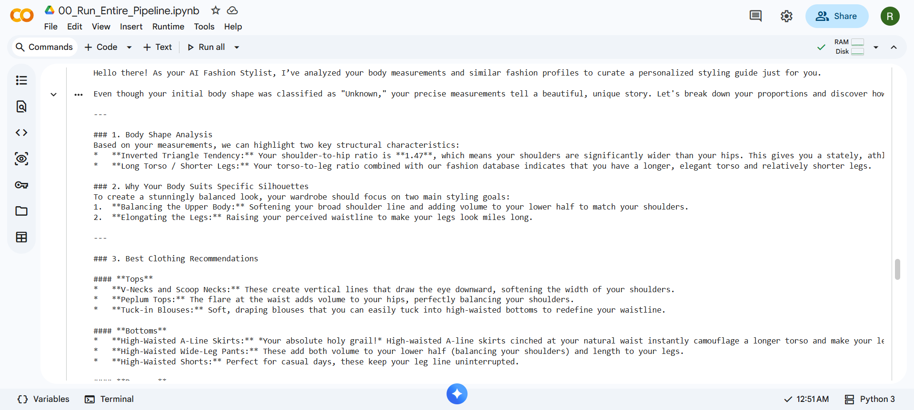

#  AI Personal Stylist


## Overview

AI Personal Stylist is an intelligent fashion recommendation system that helps users choose outfits based on their body proportions. Starting from a single full-body image, the system detects body landmarks, extracts body measurements, predicts the user's body shape, and retrieves similar fashion profiles using FAISS.

The retrieved information is combined with a fashion knowledge base and passed to Google's Gemini model using Retrieval-Augmented Generation (RAG). This enables the system to generate personalized styling advice, including suitable clothing, colors, fabrics, accessories, and seasonal outfit suggestions.

The project combines Computer Vision, Machine Learning, Similarity Search, and Generative AI to build an end-to-end AI-powered fashion recommendation pipeline.
---

## Features

- Detects 33 human body landmarks using MediaPipe Pose
- Extracts body measurements and anthropometric features automatically
- Predicts body shape using geometric body ratios
- Reduces feature dimensionality using PCA
- Retrieves visually similar body profiles using FAISS
- Uses a fashion knowledge base built from DeepFashion2 metadata
- Generates personalized outfit recommendations using Gemini and RAG
- Provides styling advice including clothing, colors, fabrics, footwear, and accessories

---

##  Project Structure

```
AI_Personal_Stylist/
│
├── datasets/
│   ├── landmarks.csv
│   ├── features.csv
│   ├── body_features_with_metadata.csv
│   ├── knowledge_base.csv
│   └── fashion_knowledge_base.csv
│
├── models/
│   ├── faiss_index.bin
│   ├── metadata.pkl
│   ├── scaler.pkl
│   ├── pca.pkl
│   ├── training_features.pkl
│   └── category_encoder.pkl
│
├── notebooks/
│   ├── 00_Run_Entire_Pipeline.ipynb
│   ├── 01_Pose_Detection.ipynb
│   ├── 02_Feature_Engineering.ipynb
│   ├── 03_Parse_DeepFashion2.ipynb
│   ├── 04_Knowledge_Base.ipynb
│   └── 05_AIStylist_RAG.ipynb
│
├── requirements.txt
├── README.md
└── .gitignore
```

---

##  Workflow

```
User uploads a full-body image
            │
            ▼
Detect body landmarks using MediaPipe Pose
            │
            ▼
Extract body measurements & engineered features
            │
            ▼
Predict body shape using rule-based analysis
            │
            ▼
Scale features and reduce dimensions using PCA
            │
            ▼
Retrieve similar body profiles using FAISS
            │
            ▼
Retrieve relevant fashion knowledge
            │
            ▼
Generate personalized recommendations with Gemini (RAG)
            │
            ▼
Final styling recommendations for the user
```

---

##  Technologies Used

### Programming

- Python

### Computer Vision

- OpenCV
- MediaPipe

### Machine Learning

- Scikit-learn
- PCA
- StandardScaler

### Similarity Search

- FAISS

### LLM & RAG

- Google Gemini API

### Data Processing

- NumPy
- Pandas

### Visualization

- Matplotlib

---

##  Datasets

This project uses:

- DeepFashion2 Dataset
- Custom body feature dataset
- Fashion knowledge base

---

##  Installation

Clone the repository

```bash
git clone https://github.com/<your-username>/AI_Personal_Stylist.git

cd AI_Personal_Stylist
```

Install dependencies

```bash
pip install -r requirements.txt
```

---

##  Running the Project

Open the notebook:

```
notebooks/00_Run_Entire_Pipeline.ipynb
```

Run all cells sequentially.

The pipeline performs:

1. Pose Detection
2. Body Feature Extraction
3. Feature Engineering
4. PCA Transformation
5. FAISS Retrieval
6. Knowledge Base Search
7. AI-powered Fashion Recommendation

---

##  Models

The project includes pre-trained artifacts:

- StandardScaler
- PCA
- FAISS Index
- Metadata
- Feature Embeddings
- Category Encoder

No model retraining is required for inference.

---

##  Sample Output

### Input


### Final Fashion Recommendation



---

## Future Improvements

- Deploy the system as a Streamlit web application.
- Support real-time recommendations using webcam input.
- Integrate Virtual Try-On functionality.
- Recommend products from online fashion stores.
- Learn user preferences over time for more personalized recommendations.
- Fine-tune a fashion-specific language model.
- Support multi-person outfit recommendations.

---

## Dataset

The full dataset used for training is available here:

[https://drive.google.com/drive/folders/159ARp9j2maH5kue9wRcMGpNpuDouNwsq?usp=sharing](https://drive.google.com/file/d/14BOexFbxex9WYqSAV7ytIIz-DJ7UAZi2/view?usp=sharing)

---


##  Author
**Riya Dey**  
*National Institute of Technology Durgapur*  

📧 [Email](mailto:riyadey3134@gmail.com)  
🌐 [LinkedIn](https://www.linkedin.com/in/riya-dey-a31b43286)
